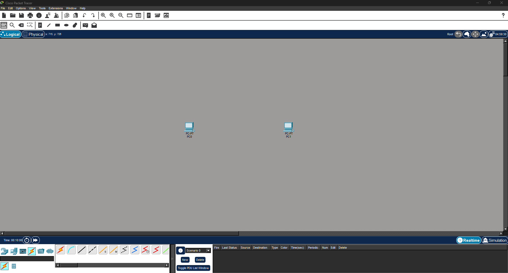
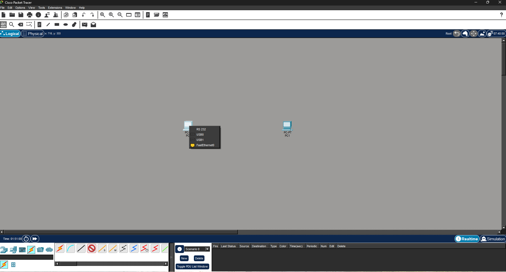
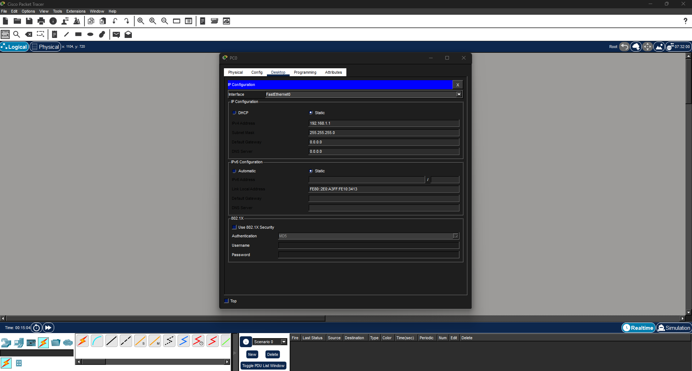
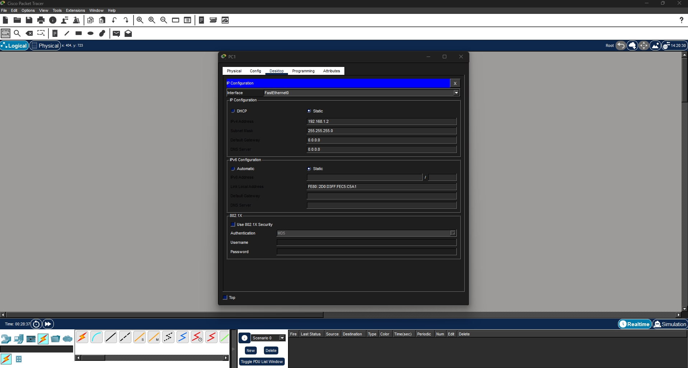
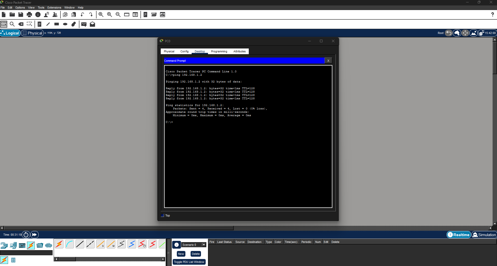
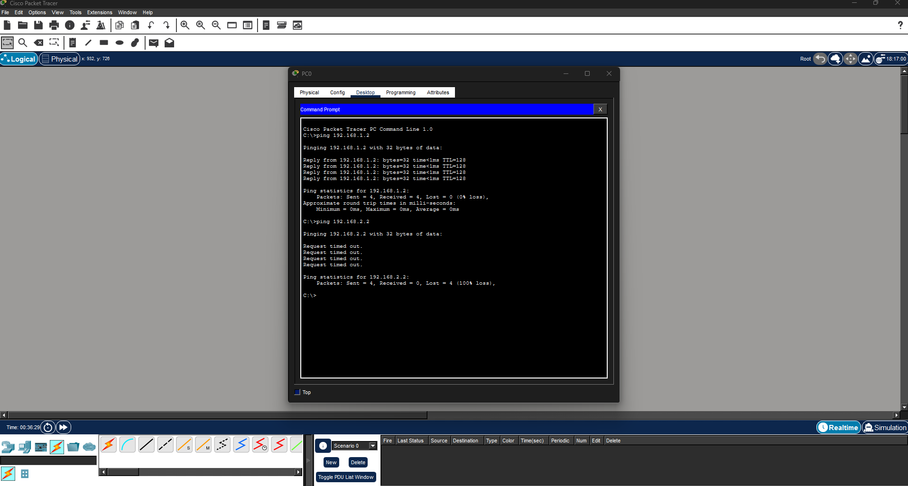

# Lab 01 – Basic Connectivity (Packet Tracer)

## Objective
Build a simple network between two PCs and verify connectivity using IP configuration and ping.

---

## Step 1: Create Topology

---

## Step 2: Connect PCs (Process)

---

## Step 3: Cable Connected

---

## Step 4: Configure IP Addresses

### PC0

### PC1

---

## Step 5: Successful Ping

---

## Step 6: Failed Ping Test

---

## What I Learned
- How to connect devices using Ethernet cables
- How to assign IP addresses manually
- How to test connectivity using ping
- The difference between successful and failed communication
  
- ## Skills Demonstrated
- Basic network setup in Cisco Packet Tracer
- IP addressing and subnet configuration
- Network troubleshooting using ping (ICMP)
- Understanding of successful vs failed connectivity

---

## Tools & Technologies
- Cisco Packet Tracer
