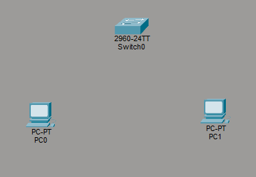
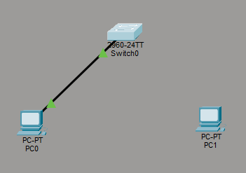
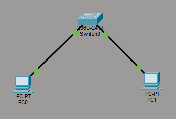
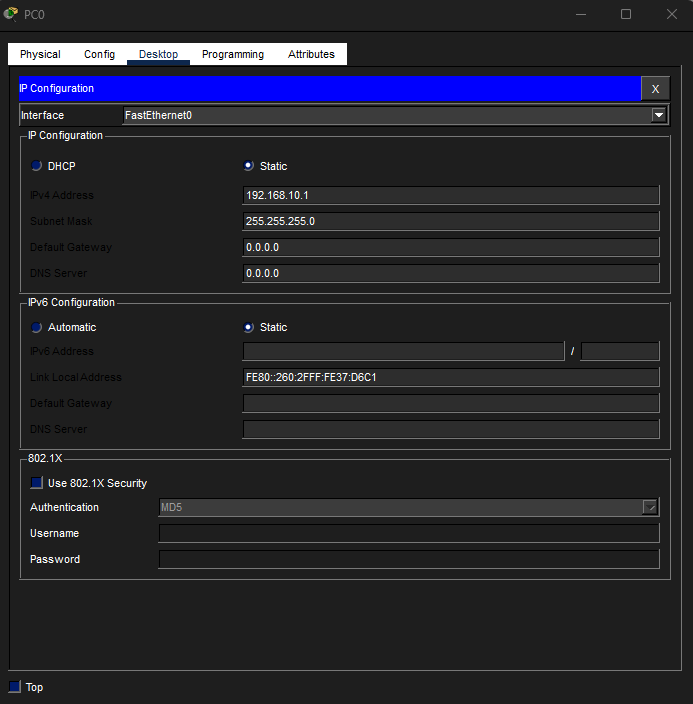
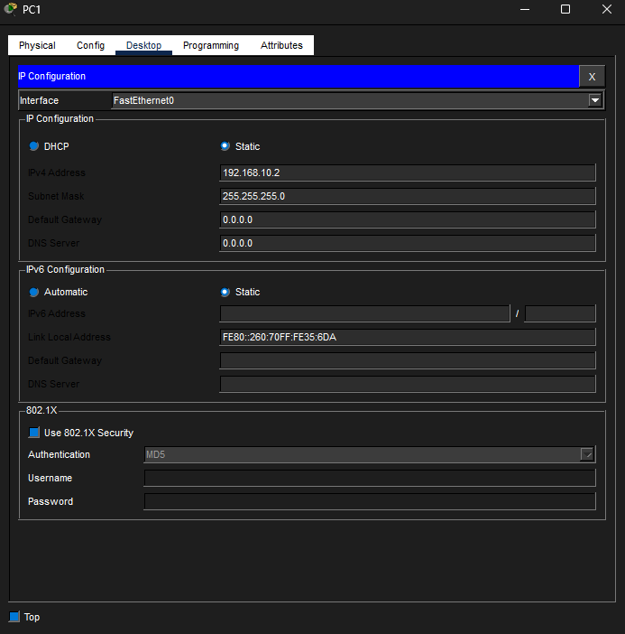
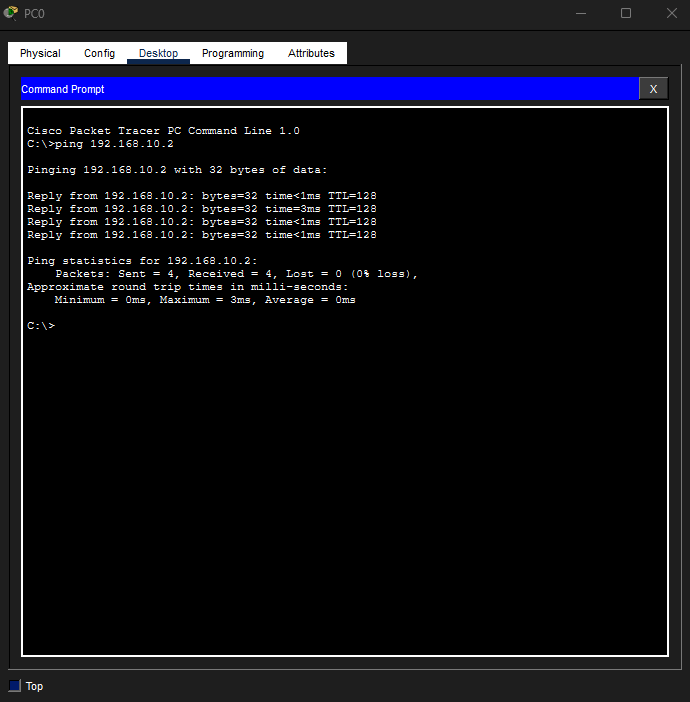
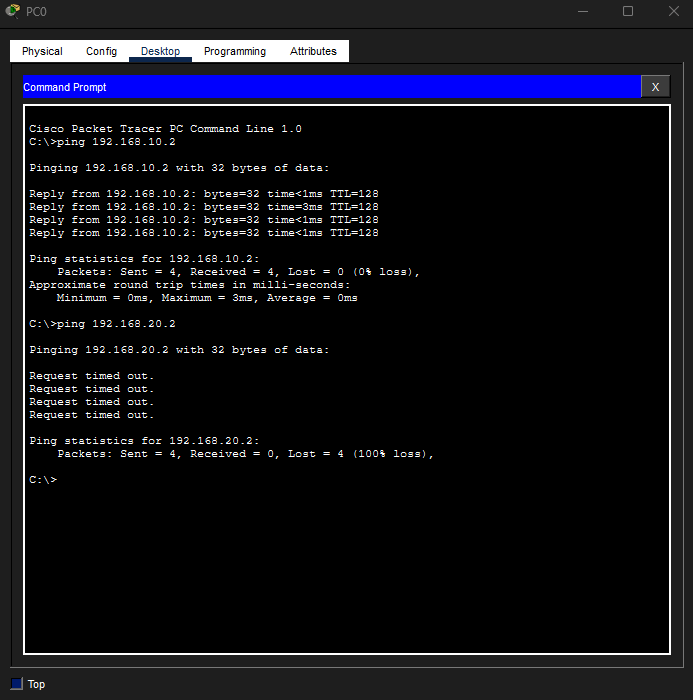

# Lab 02 – Switch Connectivity (Packet Tracer)

## Objective
Connect multiple devices through a switch, configure IP addressing, and verify connectivity.

---

## Step 1: Topology

---

## Step 2: Connect PC0 to Switch

---

## Step 3: Connect PC1 to Switch

---

## Step 4: Configure PC0

---

## Step 5: Configure PC1

---

## Step 6: Successful Ping

---

## Step 7: Failed Ping Test

---

## Skills Demonstrated
- Device connectivity through a switch
- IP addressing and subnet configuration
- Network communication using ICMP (ping)
- Troubleshooting connectivity issues

---

## Tools & Technologies
- Cisco Packet Tracer
