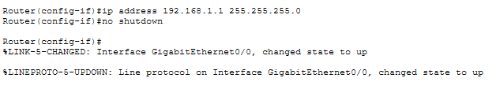
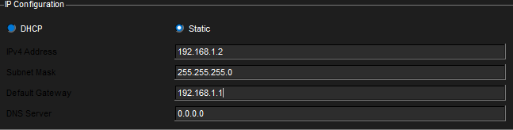
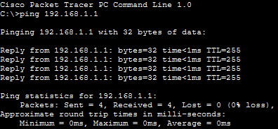

# Lab 03 – Router Interface Configuration (Packet Tracer)

## Objective
Configure a router interface, assign IP addressing, and verify connectivity between a PC and router using ping.

---

## Step 4: Configure Router Interface

---

## Step 5: Configure PC IP

---

## Step 6: Successful Ping

---

## What I Learned
- How to configure a router interface using CLI
- Importance of `no shutdown`
- How to assign IP addresses manually
- How to test connectivity using ping

---

## Skills Demonstrated
- Router configuration (basic)
- Network troubleshooting
- Understanding Layer 3 communication
