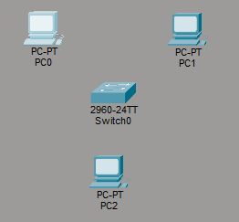
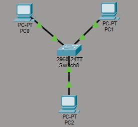
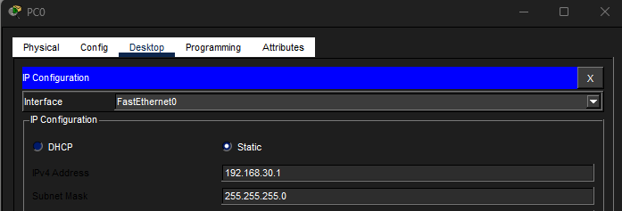
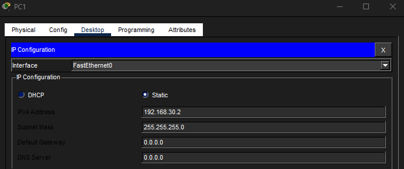
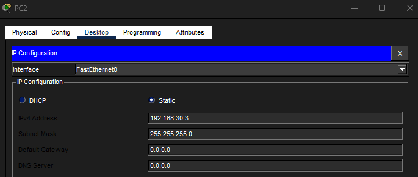
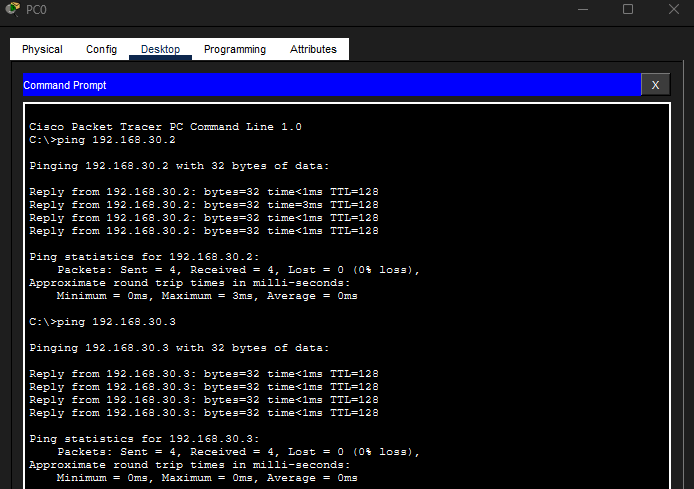
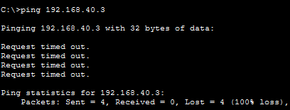

# Lab 04 – Switch Network with Three PCs

## Objective
Build a small local network using a switch and three PCs, configure IP addresses, verify connectivity, and identify what happens when one device is placed on the wrong network.

---

## Step 1: Create the Topology
Built a simple network with one switch and three PCs.

---

## Step 2: Connect PCs to the Switch
Connected each PC to the switch using copper straight-through cables.

---

## Step 3: Configure PC0
Assigned PC0 an IP address on the 192.168.30.x network.

---

## Step 4: Configure PC1
Assigned PC1 an IP address on the same network.

---

## Step 5: Configure PC2
Assigned PC2 an IP address on the same network.

---

## Step 6: Verify Successful Connectivity
Tested connectivity from PC0 to PC1 and PC2 using ping.

---

## Step 7: Test a Misconfiguration
Changed PC2 to a different network and verified that communication failed.

---

## What I Learned
- Devices on the same network can communicate through a switch.
- A switch connects devices within the same local network.
- Devices on different networks require a router to communicate.
- Misconfigured IP addresses can break communication.

---

## Cybersecurity Standards & Findings Connection
This lab connects to cybersecurity standards and findings because misconfigured network settings can create availability issues, segmentation problems, or control failures.

In a standards and findings role, it is important to:
- Identify whether devices are configured according to expected standards.
- Understand when a device is placed on the wrong network.
- Use evidence, such as ping results and configuration screenshots, to support a finding.
- Explain technical issues clearly to both technical and non-technical teams.

---

## Skills Demonstrated
- Switch-based network connectivity
- Static IP addressing
- ICMP testing with ping
- Basic troubleshooting
- Identifying network misconfiguration

---

## Tools & Technologies
- Cisco Packet Tracer
