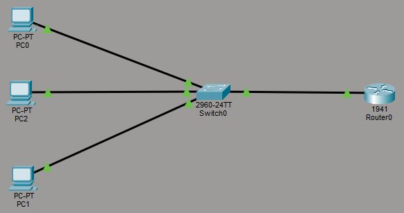
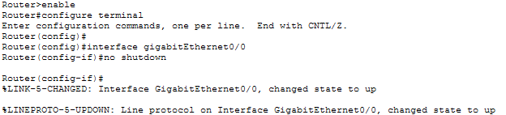
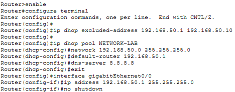
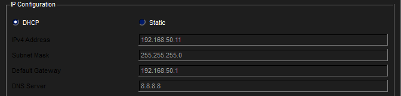
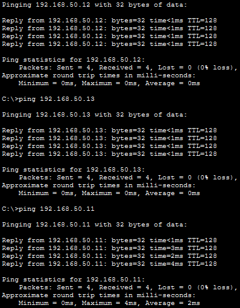

# Lab 06 – DHCP Network Configuration

## Objective
Configure a router as a DHCP server to automatically assign IP addresses to devices on a network and verify connectivity.

---

## Step 1: Build Topology
Created a network with three PCs connected to a switch, and the switch connected to a router.

---

## Step 2: Enable Router Interface
Enabled the router interface to allow communication between devices and the network.

---

## Step 3: Configure DHCP
Configured the router to act as a DHCP server, assigning IP addresses automatically.

---

## Step 4: Verify DHCP Assignment
Switched PCs to DHCP and confirmed they received IP addresses from the router.

---

## Step 5: Verify Connectivity
Tested communication between devices and the gateway using ping.

---

## What I Learned
- How DHCP automates IP address assignment
- The role of a router as a DHCP server
- Importance of correct network configuration
- How to verify network functionality using ping

---

## Cybersecurity Standards & Findings Connection
This lab demonstrates how critical DHCP configuration is in a real environment.

Improper DHCP setup can lead to:
- Devices receiving incorrect network settings
- Loss of connectivity
- Security risks from unauthorized DHCP servers

In a cybersecurity role, validating DHCP configurations ensures devices are assigned correct IPs, gateways, and DNS settings, supporting secure and reliable network operations.

---

## Skills Demonstrated
- DHCP configuration
- Router CLI usage
- Network troubleshooting
- Connectivity validation

---

## Tools Used
- Cisco Packet Tracer
