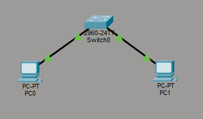
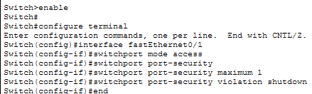
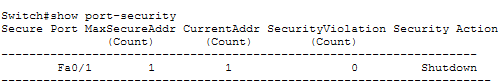

# Lab 07 – Switch Port Security

## Objective
Configure port security on a switch to restrict access to a specific device and prevent unauthorized connections.

---

## Step 1: Build Topology
Created a simple network with two PCs connected to a switch.

---

## Step 2: Configure Port Security
Configured FastEthernet0/1 to allow only one device and set violation mode to shutdown.

---

## Step 3: Verify Port Security
Validated that the port is restricted to a single MAC address and will shut down if another device attempts to connect.

---

## What I Learned
- How to configure port security on a switch
- How to restrict access to a specific device using MAC addresses
- The importance of enforcing access control at the network layer
- How to verify security configurations using CLI commands

---

## Cybersecurity Standards & Findings Connection
This lab demonstrates a fundamental network security control: restricting physical port access to authorized devices.

Without port security:
- Unauthorized devices can connect to the network
- Attackers could gain access through unused ports

With port security:
- Only approved devices are allowed
- Unauthorized access attempts are blocked

In a cybersecurity role, misconfigured or missing port security would be identified as a vulnerability and documented as a finding.

---

## Skills Demonstrated
- Switch configuration
- Port security implementation
- Network access control
- Security validation

---

## Tools Used
- Cisco Packet Tracer
