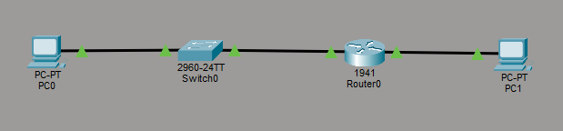
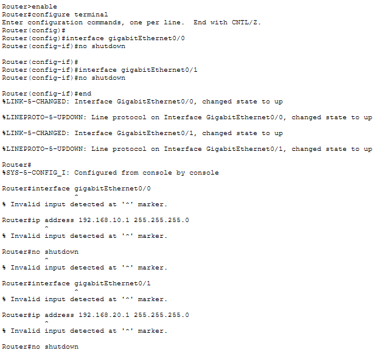
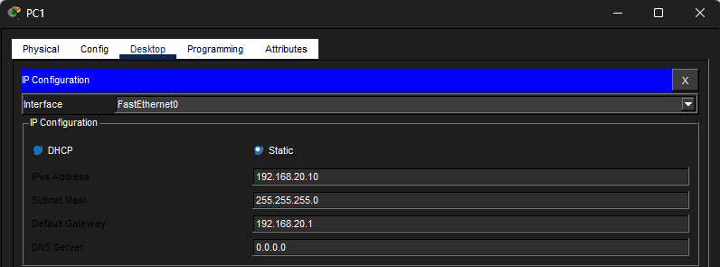
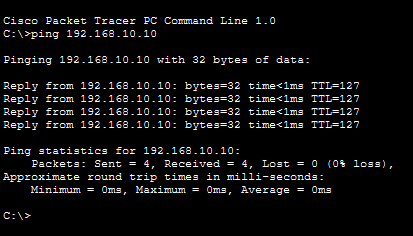
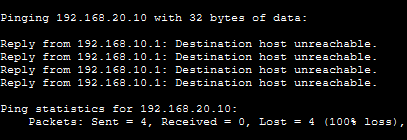
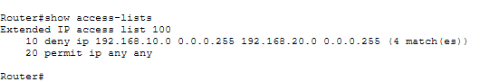

# Lab 08 – Network Segmentation & Access Control (ACL)

## Objective
Configure network segmentation using a router and enforce access control by blocking communication between two networks using an Access Control List (ACL).

---

## Step 1: Build Topology
Created a network with two separate subnets connected through a router.

---

## Step 2: Configure IP Addresses
Assigned IP addresses to both networks and configured the router interfaces.

---

## Step 3: Verify Connectivity
Tested communication between networks to confirm routing was working.

---

## Step 4: Block Communication (ACL)
Configured an ACL on the router to deny traffic between the two networks.

---

## Step 5: Verify ACL Enforcement
Confirmed that the ACL is actively blocking traffic and logging matches.

---

## What I Learned
- How to create and apply Access Control Lists (ACLs)
- How to control traffic between networks
- The importance of network segmentation for security
- How to validate security controls using CLI commands

---

## Cybersecurity Standards & Findings Connection
This lab demonstrates how access control policies are enforced at the network level.

Without segmentation:
- All devices can communicate freely
- Attackers can move laterally across the network

With ACL enforcement:
- Communication is restricted based on policy
- Unauthorized traffic is blocked
- Network access is controlled and monitored

In a cybersecurity role, failure to implement proper segmentation would be identified as a critical security finding.

---

## Skills Demonstrated
- Network segmentation
- ACL configuration
- Traffic control and enforcement
- Security validation

---

## Tools Used
- Cisco Packet Tracer
