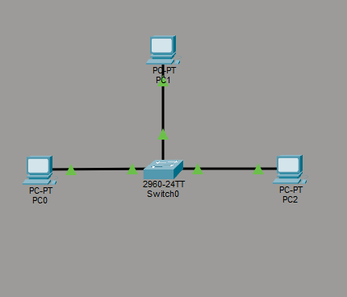
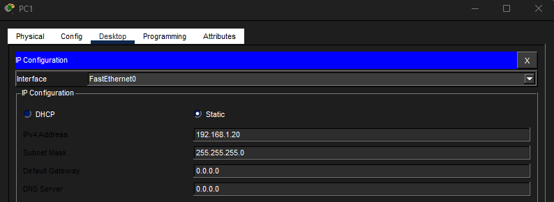
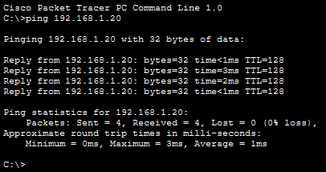
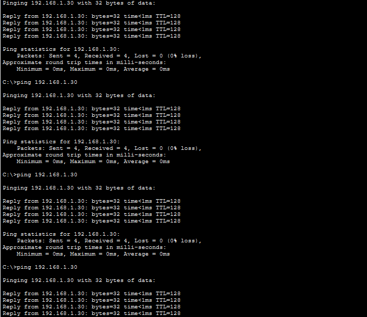
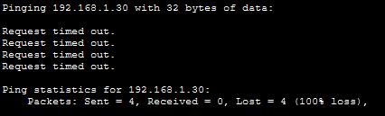
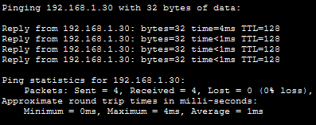

# Lab 09 – Network Monitoring & Traffic Awareness

## Objective
Observe normal, repeated, failed, and restored network communication to better understand traffic behavior and monitoring concepts.

---

## Step 1: Build Topology & Configure IP Addresses
Created a flat network with three PCs connected to a switch and assigned IP addresses within the same subnet.

---

## Step 2: Generate Normal Traffic
Tested successful communication between devices to establish baseline traffic behavior.

---

## Step 3: Simulate Repeated Traffic
Generated repeated communication between devices to observe continuous traffic patterns.

---

## Step 4: Simulate Failed Communication
Disconnected a device from the network and observed failed traffic attempts.

---

## Step 5: Restore Connectivity
Reconnected the device and verified communication was restored successfully.

---

## What I Learned
- How to recognize normal vs abnormal traffic behavior
- How repeated communication patterns may appear suspicious
- How failed communication can indicate outages or connectivity issues
- The importance of monitoring traffic behavior in cybersecurity

---

## Cybersecurity Monitoring Connection
This lab demonstrates the importance of visibility and monitoring within a network.

Security teams monitor:
- repeated communication patterns
- failed traffic attempts
- outages and service interruptions
- abnormal network behavior

Understanding what “normal” traffic looks like helps analysts identify suspicious or unexpected activity more effectively.

---

## Skills Demonstrated
- Network monitoring awareness
- Traffic pattern observation
- Connectivity troubleshooting
- Availability validation

---

## Tools Used
- Cisco Packet Tracer
