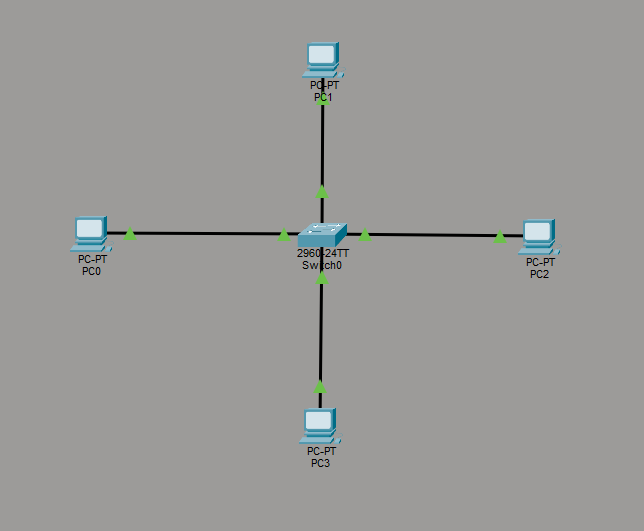
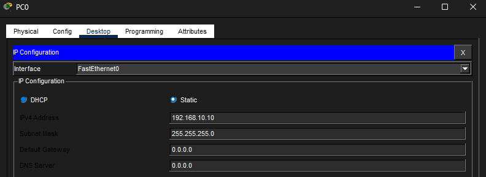
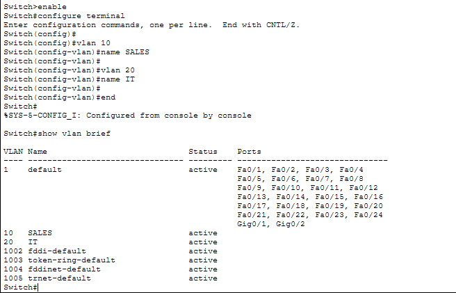
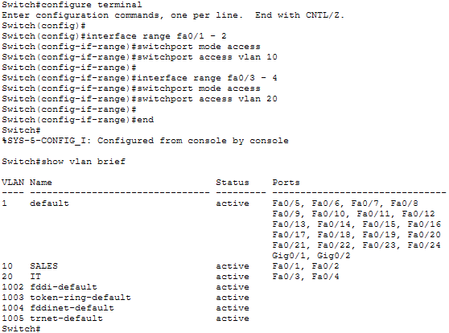
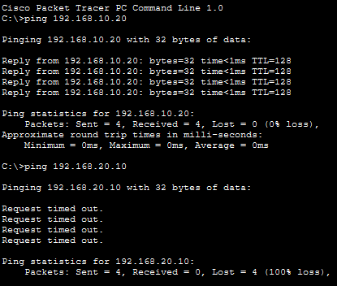
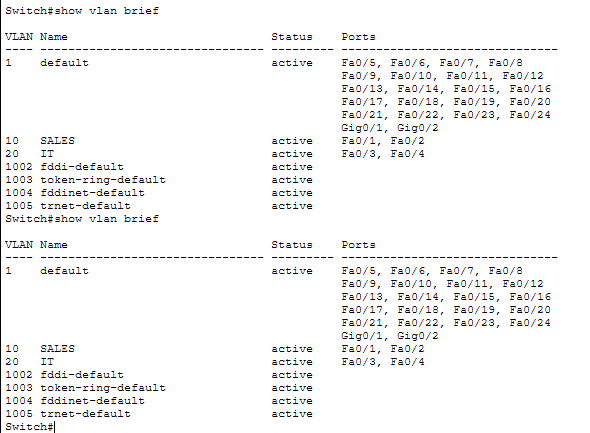

# Lab 10 – VLAN Segmentation

## Objective
Configure VLANs on a switch to logically separate devices into different networks and restrict communication between them.

---

## Step 1: Build Topology & Configure IP Addresses
Created a network with four PCs connected to a switch and assigned IP addresses across two subnets.

---

## Step 2: Create VLANs
Configured VLAN 10 (SALES) and VLAN 20 (IT) on the switch.

---

## Step 3: Assign Ports to VLANs
Assigned switch ports to the appropriate VLANs to separate the network logically.

---

## Step 4: Test VLAN Communication
Verified that devices in the same VLAN can communicate and devices in different VLANs cannot.

---

## Step 5: Final Verification
Validated VLAN configuration and port assignments using CLI commands.

---

## What I Learned
- How to create and configure VLANs
- How to assign switch ports to specific VLANs
- How VLANs provide logical network segmentation
- How to validate segmentation through communication testing

---

## Cybersecurity Segmentation Connection
This lab demonstrates how VLANs are used to segment networks and restrict communication between groups of devices.

Without VLANs:
- All devices share the same network
- Traffic flows freely between systems

With VLANs:
- Devices are logically separated
- Communication is restricted by default
- Network access is controlled

In real-world environments, VLAN segmentation helps reduce the risk of lateral movement and improves overall network security.

---

## Skills Demonstrated
- VLAN configuration
- Network segmentation
- Traffic restriction
- Network validation

---

## Tools Used
- Cisco Packet Tracer
