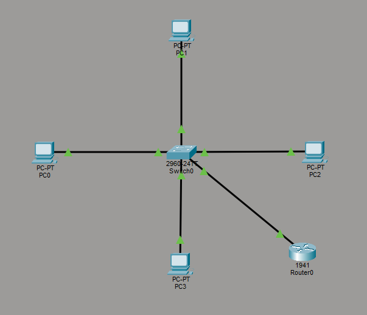
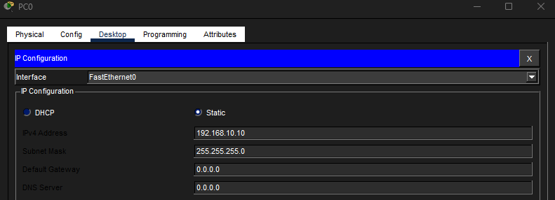
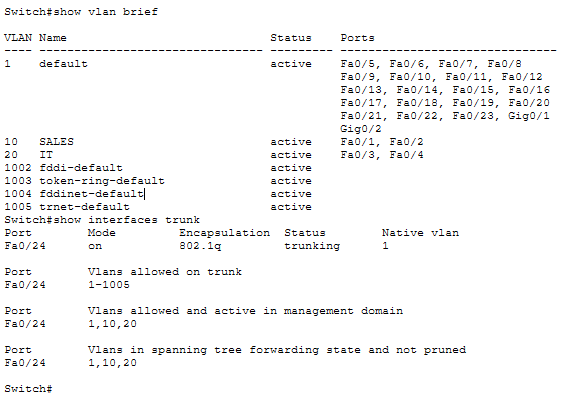
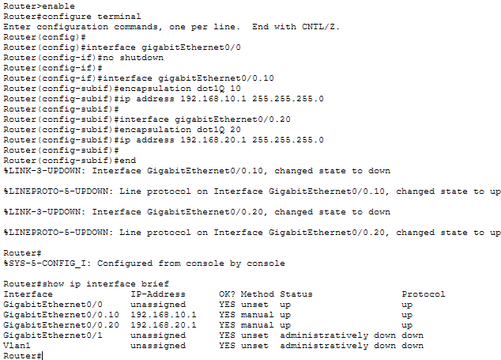
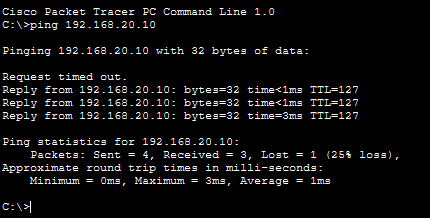
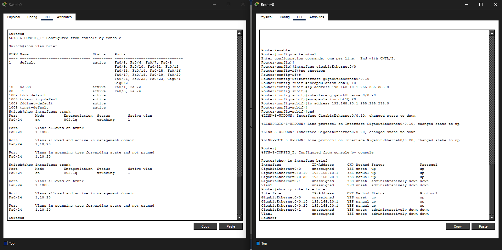

# Lab 11 – Inter-VLAN Routing (Router-on-a-Stick)

## Objective
Enable communication between VLANs using a router and trunk link.

---

## Step 1: Build Topology & Configure IP Addresses

---

## Step 2: Create VLANs & Configure Trunk

---

## Step 3: Configure Router Subinterfaces

---

## Step 4: Test Inter-VLAN Communication

---

## Step 5: Final Verification

---

## What I Learned
- How to configure inter-VLAN routing using a router
- How trunk links carry multiple VLANs
- How routers enable controlled communication between segments
- How to validate routing and segmentation together

---

## Cybersecurity Connection
This lab demonstrates how segmented networks can still communicate through controlled routing.

Routers act as control points where:
- traffic can be allowed or denied
- security policies can be enforced
- communication between zones is managed

This is critical for limiting lateral movement while maintaining functionality.

---

## Skills Demonstrated
- VLAN configuration
- trunking
- router-on-a-stick configuration
- network segmentation and controlled routing
- validation and troubleshooting

---

## Tools Used
- Cisco Packet Tracer
