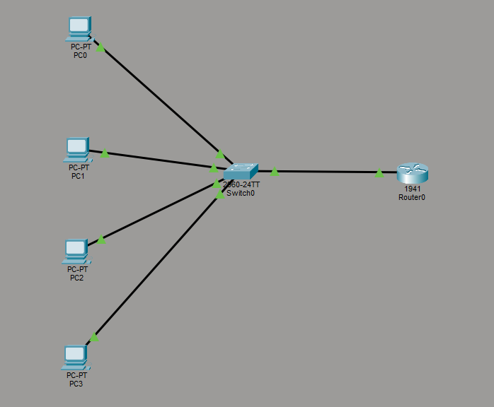
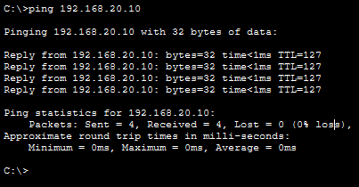
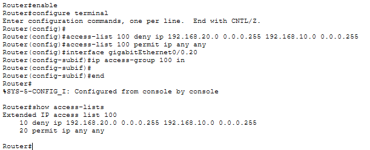
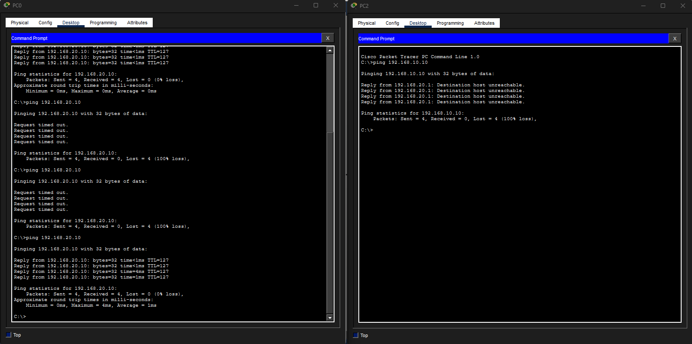
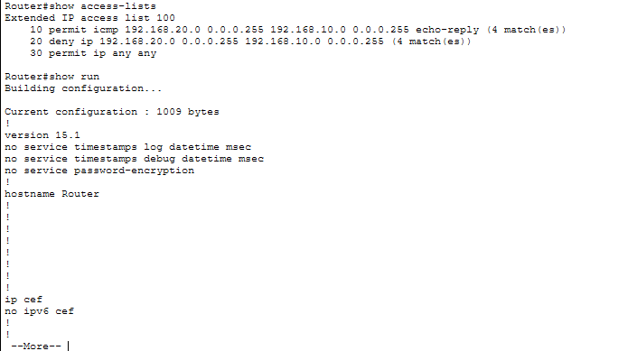

# Lab 12 – VLAN ACL Enforcement

## Objective
Implement ACL-based security policies between VLANs to control and restrict communication between network segments.

---

## Step 1: Baseline Connectivity
Configured inter-VLAN routing and verified that communication between VLANs worked before applying security restrictions.

---

## Step 2: Configure ACL Security Policy
Created and applied an ACL to block VLAN 20 from initiating communication to VLAN 10.

---

## Step 3: Test ACL Enforcement
Verified that VLAN 10 could communicate with VLAN 20 while VLAN 20 was denied access to VLAN 10.

---

## Step 4: Final Verification
Validated ACL rules and confirmed traffic matches against the configured security policy.

---

## What I Learned
- How ACLs enforce directional traffic policies
- How routers control communication between VLANs
- How to validate allowed and denied traffic behavior
- How segmentation and ACLs work together to improve security

---

## Cybersecurity Connection
This lab demonstrates how ACLs are used to enforce communication policies between segmented networks.

By controlling which VLANs can initiate communication, organizations can:
- reduce unauthorized access
- limit lateral movement
- protect sensitive systems
- monitor policy violations

This is a foundational concept in network security and security monitoring environments.

---

## Skills Demonstrated
- VLAN segmentation
- Inter-VLAN routing
- ACL configuration
- Policy enforcement
- Traffic validation
- Security troubleshooting

---

## Tools Used
- Cisco Packet Tracer
