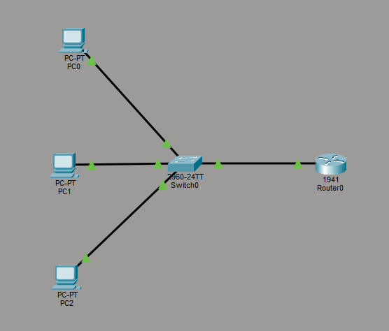
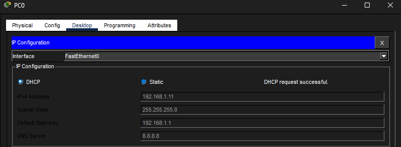
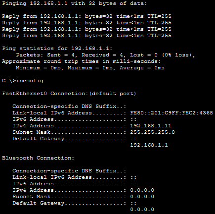
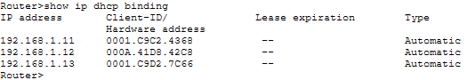

# Lab 13 – DHCP Configuration & IP Automation

## Objective
Configure a router to function as a DHCP server and automatically assign IP addresses, gateways, and DNS settings to client devices.

---

## Step 1: Build Topology & Configure Router
Built a small network topology consisting of a router, switch, and multiple PCs. Configured the router interface and prepared it to provide DHCP services.

---

## Step 2: Configure DHCP & Obtain Automatic Addresses
Configured a DHCP pool on the router and verified that client devices automatically received valid IP addresses, subnet masks, gateways, and DNS settings.

---

## Step 3: Test Network Connectivity
Verified successful communication between a client device and the default gateway.

---

## Step 4: Verify DHCP Bindings
Validated DHCP lease assignments and confirmed that the router tracked dynamically assigned client addresses.

---

## What I Learned
- How DHCP automates IP address assignment
- How routers function as DHCP servers
- How clients automatically receive gateway and DNS information
- How to validate DHCP lease assignments and troubleshoot connectivity

---

## Cybersecurity Connection
DHCP plays a critical role in network operations and security.

Organizations rely on DHCP to:
- centrally manage IP addressing
- control network configuration
- track connected devices
- simplify large-scale deployments

Misconfigured or rogue DHCP services can:
- redirect traffic
- disrupt communication
- create security risks

Understanding DHCP behavior is important for both network administrators and security analysts.

---

## Skills Demonstrated
- DHCP configuration
- Router configuration
- Automatic IP provisioning
- Connectivity validation
- DHCP lease verification
- Troubleshooting

---

## Tools Used
- Cisco Packet Tracer
