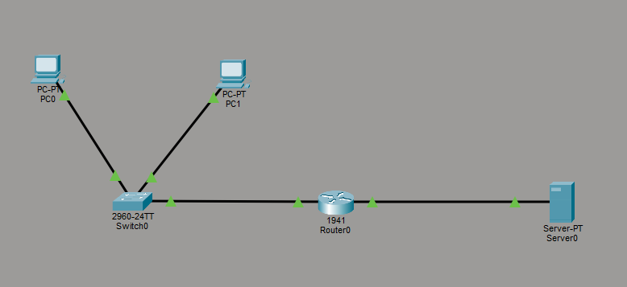
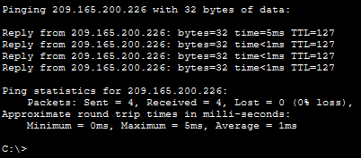
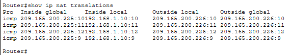
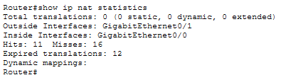

# Lab 14 – NAT Configuration & Address Translation

## Objective
Configure NAT (Network Address Translation) to allow private internal devices to communicate with an external/public network.

---

## Step 1: Build Topology & Configure Interfaces
Built a topology consisting of an internal private network, a router, and an external/public server. Configured router interfaces for both inside and outside networks.

---

## Step 2: Test NAT Connectivity
Verified successful communication between an internal private device and the external/public server.

---

## Step 3: Verify NAT Translations
Validated NAT translation entries and confirmed that private addresses were translated into a public address through PAT overload.

---

## Step 4: Verify NAT Statistics
Verified NAT statistics including translation hits, inside/outside interfaces, and translation activity.

---

## What I Learned
- How NAT translates private IP addresses into public addresses
- How PAT allows multiple devices to share one public IP
- How routers track active NAT translations
- How inside and outside interfaces function during translation

---

## Cybersecurity Connection
NAT plays an important role in network security by helping hide internal addressing structures from external networks.

This lab demonstrated:
- inside vs outside network boundaries
- public vs private addressing
- traffic translation tracking
- how translated traffic appears from an external perspective

Understanding NAT is important for:
- firewall analysis
- SIEM investigations
- troubleshooting outbound traffic
- identifying internal systems behind translated addresses

---

## Skills Demonstrated
- NAT configuration
- PAT overload configuration
- Router configuration
- Connectivity testing
- Translation verification
- Troubleshooting

---

## Tools Used
- Cisco Packet Tracer
