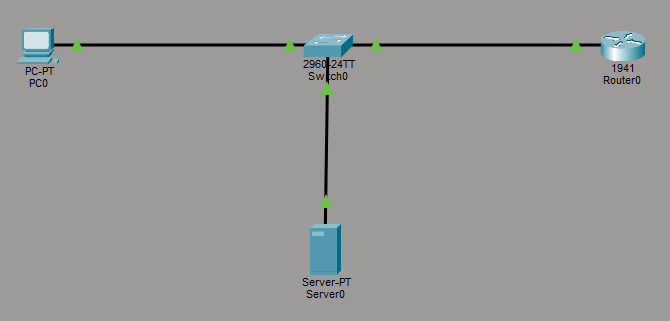
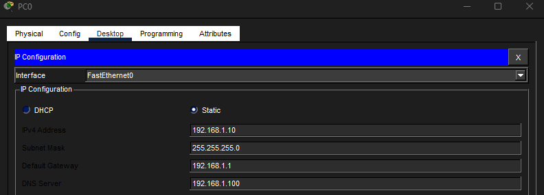
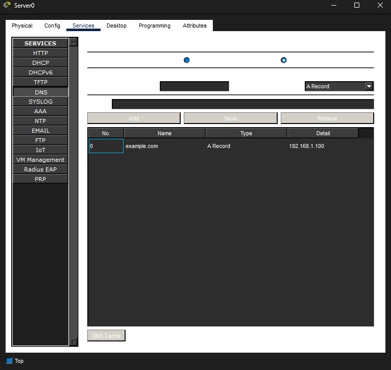
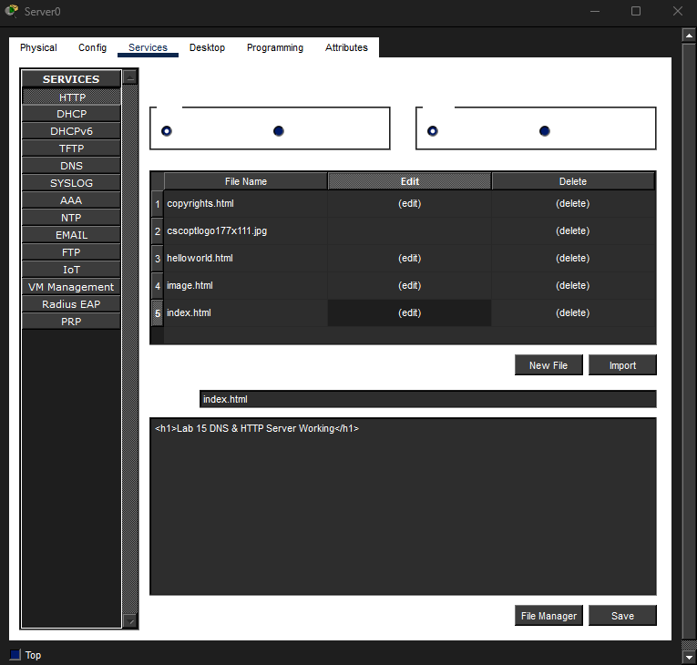
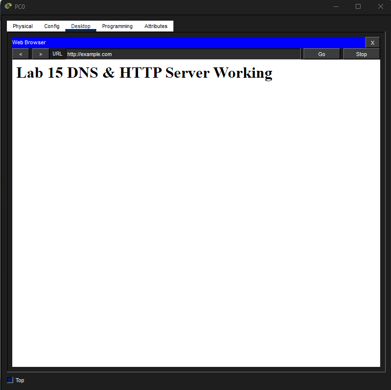

# Lab 15 – DNS & HTTP Traffic

## Objective
Configure DNS and HTTP services to allow a client device to access a web server by domain name instead of IP address.

---

## Step 1: Build Topology & Configure Addressing
Built a small network consisting of a router, switch, PC, and server. Configured static IP addressing, gateways, and DNS settings.

---

## Step 2: Configure DNS Service
Configured the server to function as a DNS server and created a DNS record mapping a domain name to the web server IP address.

---

## Step 3: Configure HTTP Service
Configured the server to host a web page using the HTTP service and customized the index page.

---

## Step 4: Access Website by Domain Name
Verified successful DNS resolution and HTTP communication by accessing the website through the domain name instead of the IP address.

---

## What I Learned
- How DNS translates domain names into IP addresses
- How HTTP delivers web content between clients and servers
- How DNS and HTTP work together during web requests
- How to troubleshoot connectivity, DNS, and application-layer issues

---

## Cybersecurity Connection
DNS and HTTP are heavily monitored in cybersecurity environments because attackers often abuse them for:
- phishing
- malicious domains
- command-and-control communication
- suspicious web traffic

This lab reinforced how analysts investigate:
- DNS resolution failures
- domain-to-IP mappings
- web traffic behavior
- service-layer communication

---

## Skills Demonstrated
- DNS configuration
- HTTP server configuration
- Static IP configuration
- Connectivity testing
- DNS troubleshooting
- Web traffic validation

---

## Tools Used
- Cisco Packet Tracer
