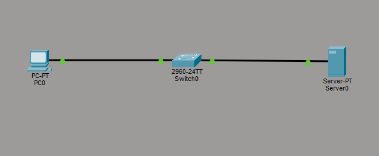
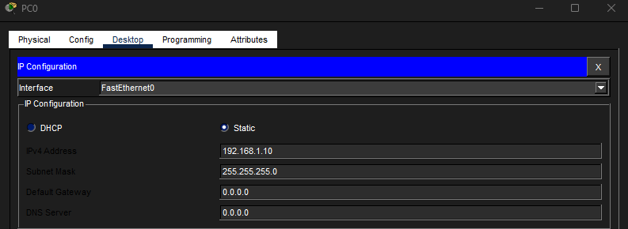
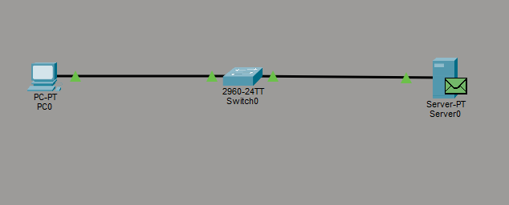
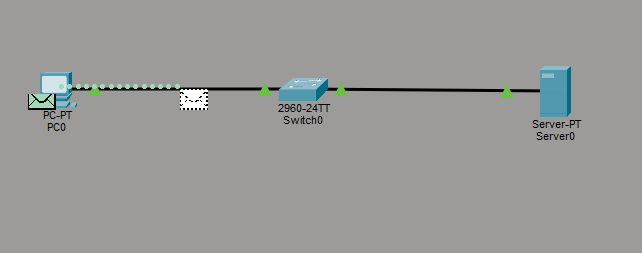
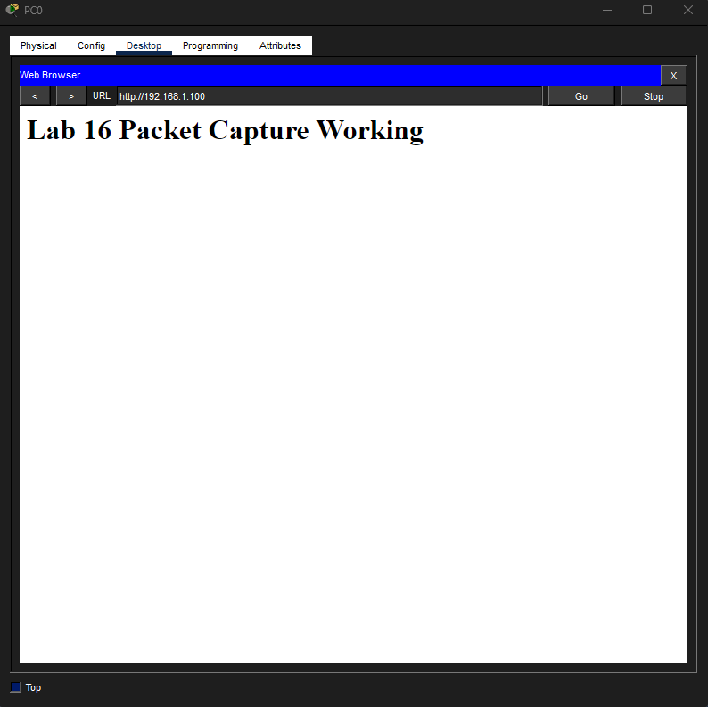

# Lab 16 – Packet Capture & Traffic Analysis

## Objective
Use Packet Tracer simulation mode to observe and analyze ICMP and HTTP traffic between a client and server.

---

## Step 1: Build Topology & Configure Addressing
Built a simple network consisting of a PC, switch, and server. Configured static IP addresses and enabled HTTP service on the server.

---

## Step 2: Capture ICMP Traffic
Used Simulation Mode to observe ICMP echo request and echo reply traffic generated by a ping test between the PC and server.

---

## Step 3: Capture HTTP Traffic
Generated HTTP traffic by requesting a webpage from the server and observed packet movement through the network in Simulation Mode.

---

## Step 4: Verify Webpage Delivery
Verified successful HTTP communication by loading the hosted webpage from the server onto the client PC.

---

## What I Learned
- How ICMP traffic works during ping communication
- How HTTP traffic flows between clients and servers
- How to observe packet movement using Simulation Mode
- The difference between request and response traffic
- How traffic moves across a switched network

---

## Cybersecurity Connection
Packet analysis is a critical skill in cybersecurity and network operations.

This lab reinforced how analysts use packet captures to:
- investigate suspicious traffic
- analyze protocol behavior
- troubleshoot communication issues
- inspect request/response patterns
- validate network activity

Understanding packet-level communication is foundational for:
- threat hunting
- malware analysis
- incident response
- network forensics

---

## Skills Demonstrated
- Packet analysis
- ICMP traffic analysis
- HTTP traffic analysis
- Simulation Mode usage
- Traffic troubleshooting
- Client/server communication analysis

---

## Tools Used
- Cisco Packet Tracer
