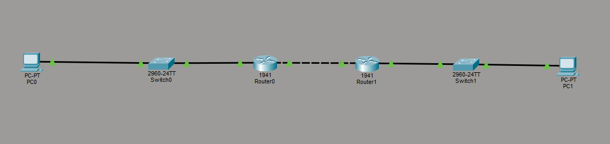
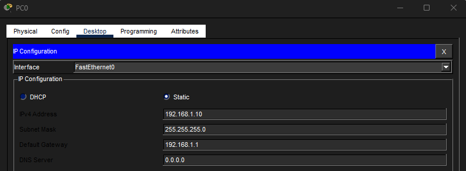
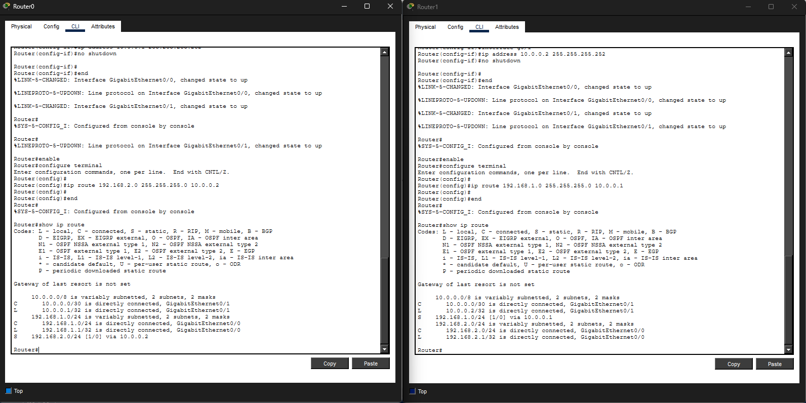
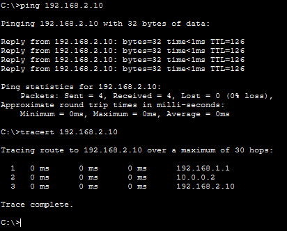
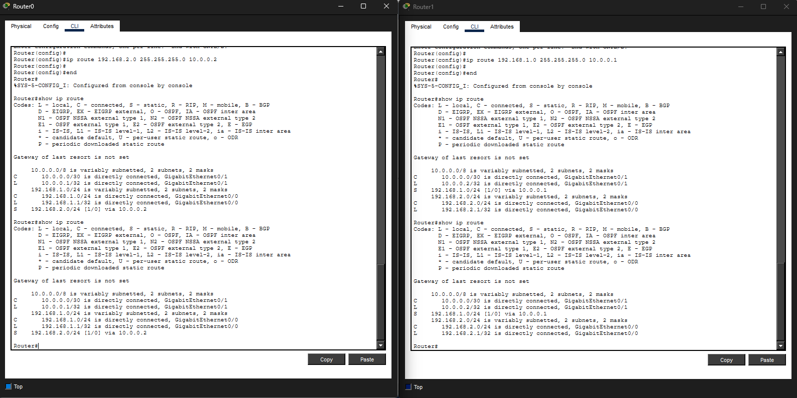

# Lab 17 – Static Routing Basics

## Objective
Configure static routes between two routers to allow communication between separate networks.

---

## Step 1: Build Multi-Network Topology
Built a topology consisting of:
- 2 routers
- 2 switches
- 2 PCs

Configured IP addressing for each LAN and for the router-to-router transit network.

---

## Step 2: Configure Static Routes
Configured static routes on both routers so each router could reach the remote network through the correct next-hop address.

---

## Step 3: Verify End-to-End Connectivity
Verified successful communication between separate networks using:
- ping
- tracert

The traceroute output showed the path traffic followed between routers before reaching the destination host.

---

## Step 4: Inspect Routing Tables
Verified connected, local, and static routes inside the routing table using the `show ip route` command.

---

## What I Learned
- How routers move traffic between different networks
- How static routes manually define traffic paths
- How routing tables determine where packets are forwarded
- How traceroute reveals traffic traversal paths
- The relationship between local, connected, and static routes

---

## Cybersecurity Connection
Understanding routing is essential in cybersecurity because analysts often investigate:
- traffic paths
- segmentation boundaries
- routing behavior
- communication between networks
- suspicious traffic traversal

Routing knowledge is heavily used during:
- network troubleshooting
- firewall placement
- incident response
- traffic analysis
- network architecture reviews

---

## Skills Demonstrated
- Static route configuration
- Multi-router topology setup
- Routing table analysis
- Traceroute usage
- Inter-network troubleshooting
- Layer 3 connectivity testing

---

## Tools Used
- Cisco Packet Tracer
