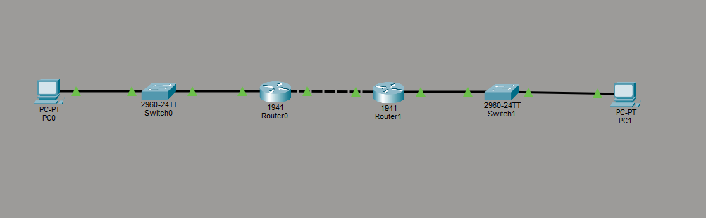
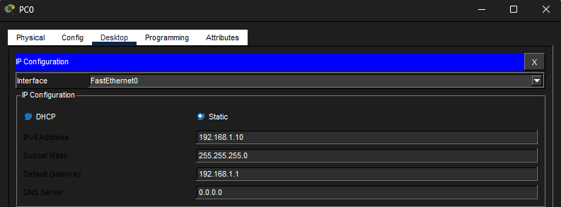
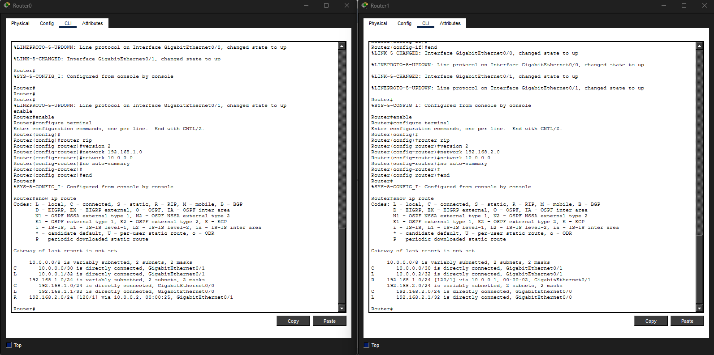
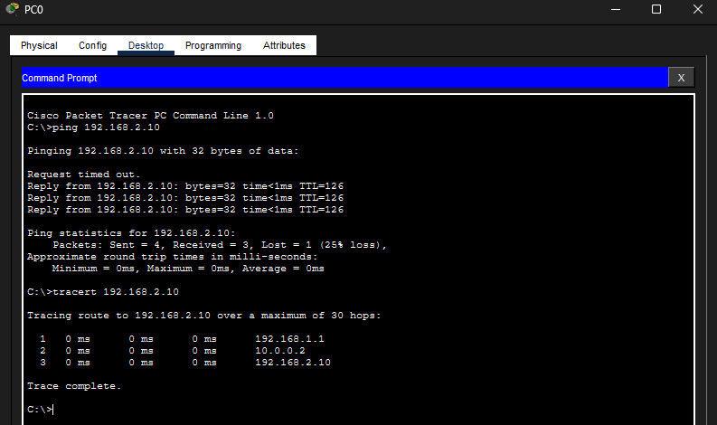
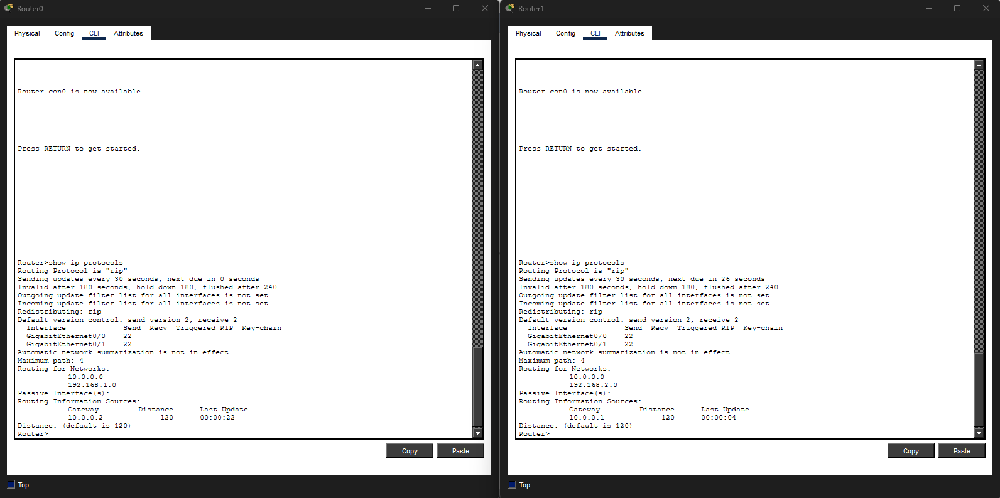

# Lab 18 – Dynamic Routing Basics (RIP)

## Objective
Configure dynamic routing using RIP version 2 to allow routers to automatically learn remote networks.

---

## Step 1: Build Multi-Network Topology
Built a topology consisting of:
- 2 routers
- 2 switches
- 2 PCs

Configured LAN addressing and router-to-router transit addressing.

---

## Step 2: Configure RIP Dynamic Routing
Configured RIP version 2 on both routers to dynamically advertise and learn routes between networks.

Verified dynamically learned routes using the routing table.

---

## Step 3: Verify End-to-End Connectivity
Tested communication between separate networks using:
- ping
- tracert

Traceroute confirmed traffic successfully traversed multiple routers before reaching the destination host.

---

## Step 4: Verify RIP Protocol Operation
Used the `show ip protocols` command to inspect:
- RIP version
- advertised networks
- update timers
- routing information sources

---

## What I Learned
- How dynamic routing differs from static routing
- How RIP automatically shares route information between routers
- How routers learn remote networks dynamically
- How hop count influences RIP routing decisions
- How to verify routing protocols and learned routes

---

## Cybersecurity Connection
Understanding dynamic routing is important in cybersecurity because analysts often investigate:
- routing behavior
- traffic paths
- network segmentation
- route advertisements
- communication between enterprise networks

Routing protocol knowledge is valuable during:
- traffic analysis
- incident response
- network troubleshooting
- infrastructure monitoring
- network architecture reviews

---

## Skills Demonstrated
- RIP version 2 configuration
- Dynamic route verification
- Routing table analysis
- Traceroute analysis
- Multi-router connectivity troubleshooting
- Layer 3 routing concepts

---

## Tools Used
- Cisco Packet Tracer
