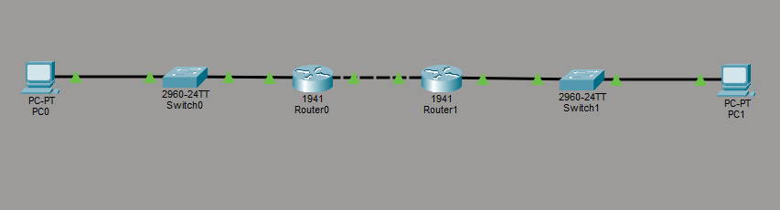
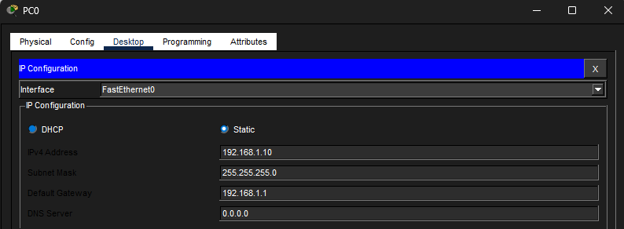
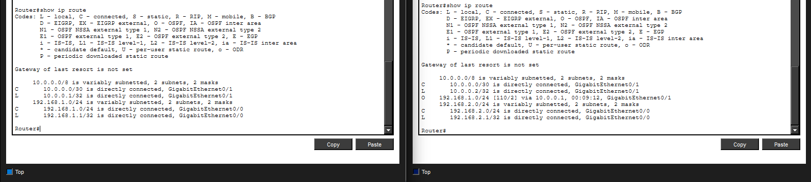
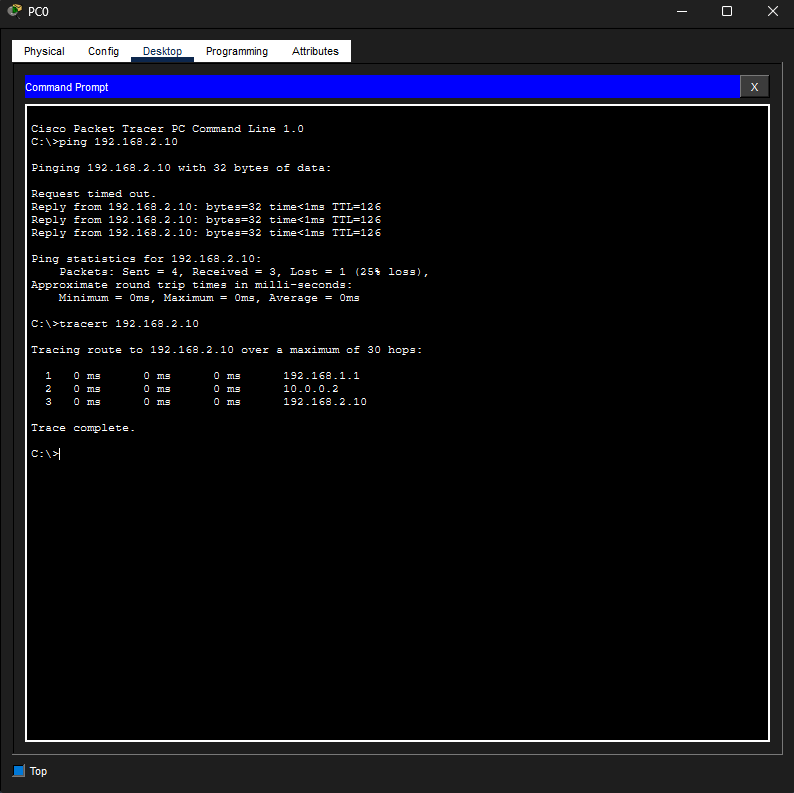
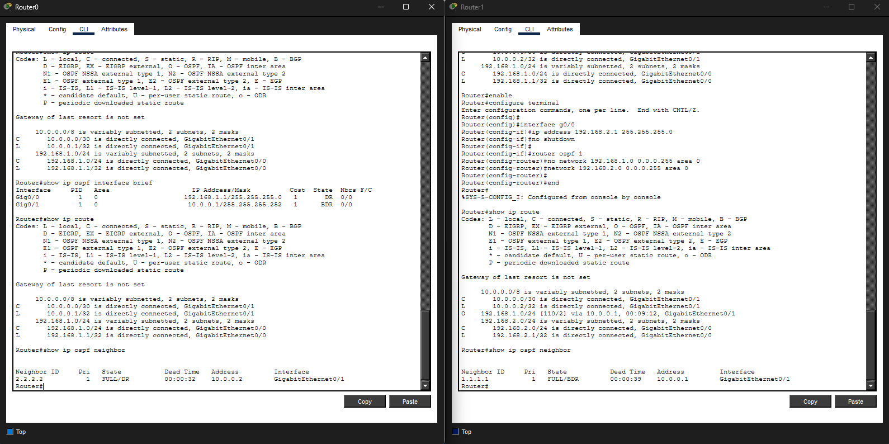

# Lab 19 – OSPF Basics

## Objective
Configure OSPF dynamic routing to allow routers to automatically discover neighbors and learn remote networks.

---

## Step 1: Build Multi-Router Topology
Built a topology consisting of:
- 2 routers
- 2 switches
- 2 PCs

Configured:
- LAN addressing
- router-to-router transit network
- default gateways

---

## Step 2: Configure OSPF Dynamic Routing
Configured OSPF process 1 on both routers using:
- wildcard masks
- Area 0
- network advertisements

Verified dynamically learned OSPF routes using routing tables.

---

## Step 3: Verify End-to-End Connectivity
Tested communication between remote networks using:
- ping
- tracert

Traceroute confirmed packets successfully traversed multiple routers before reaching the destination host.

---

## Step 4: Verify OSPF Neighbor Relationships
Used the `show ip ospf neighbor` command to verify:
- FULL adjacency state
- DR/BDR elections
- neighbor relationships
- OSPF communication

---

## What I Learned
- How OSPF differs from RIP and static routing
- How routers dynamically form OSPF neighbor relationships
- How OSPF exchanges route information automatically
- How wildcard masks are used in OSPF
- How Area 0 functions as the OSPF backbone
- How DR and BDR elections occur
- How to troubleshoot OSPF neighbor formation issues

---

## Cybersecurity Connection
Understanding OSPF is important in cybersecurity because enterprise environments rely heavily on dynamic routing protocols for:
- traffic path selection
- network segmentation
- route visibility
- infrastructure monitoring
- incident response investigations
- enterprise traffic analysis

Security analysts and network defenders often need to understand how routing protocols influence traffic movement throughout a network.

---

## Skills Demonstrated
- OSPF configuration
- Dynamic route verification
- OSPF neighbor troubleshooting
- Routing table analysis
- Traceroute analysis
- Enterprise routing concepts
- Multi-router network troubleshooting

---

## Tools Used
- Cisco Packet Tracer
