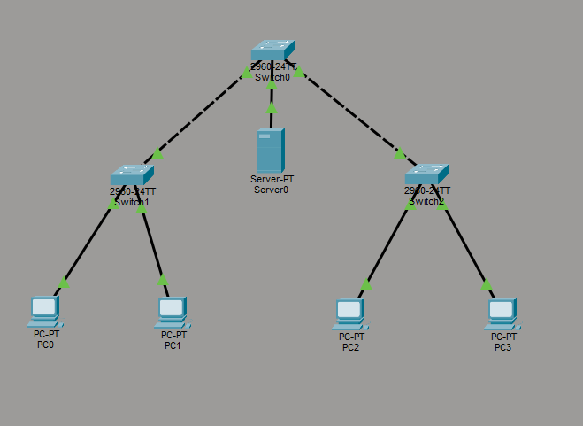
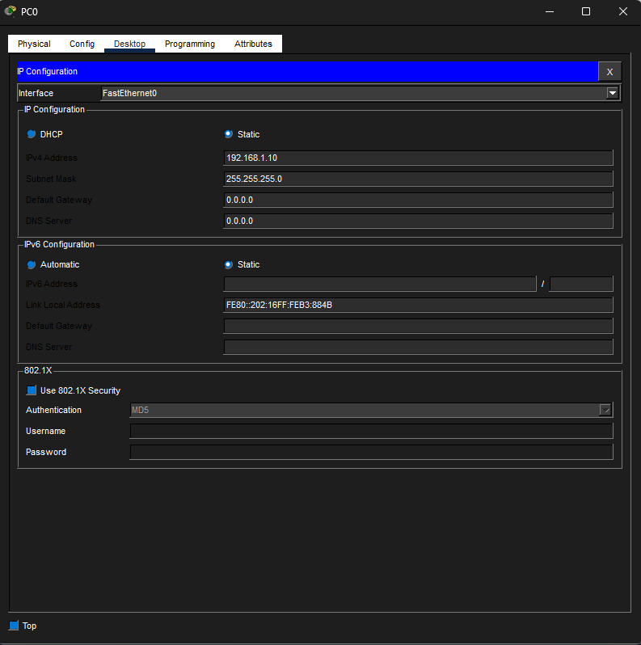
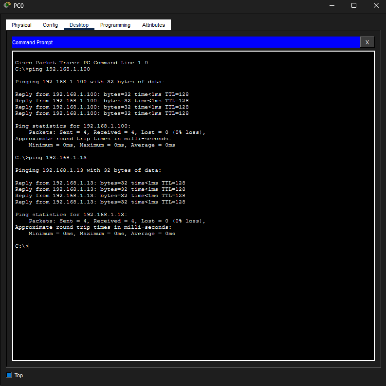
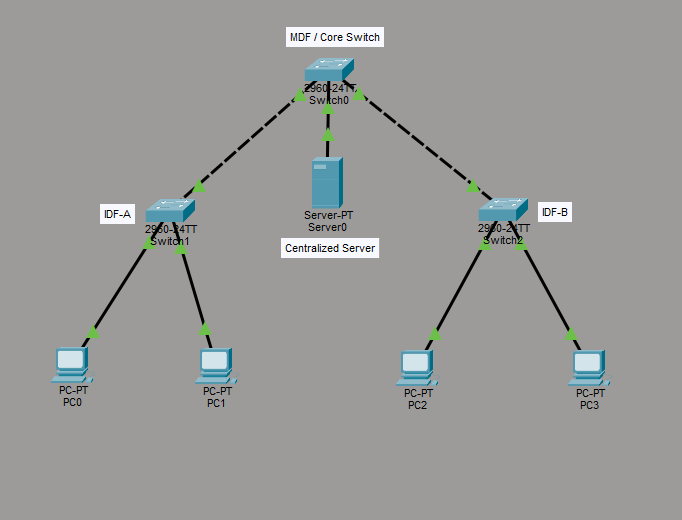

# Lab 20 – Enterprise Distribution Infrastructure

## Objective
Build and visualize an enterprise-style distribution infrastructure using MDF and IDF concepts within Cisco Packet Tracer.

---

## Step 1: Build Enterprise Distribution Topology
Created a hierarchical network topology representing:
- a Main Distribution Frame (MDF)
- multiple Intermediate Distribution Frames (IDFs)
- centralized server infrastructure
- distributed client endpoints

Configured:
- structured switch hierarchy
- switch uplinks
- end-device connectivity
- IP addressing for all endpoints

---

## Step 2: Verify Infrastructure Connectivity
Tested:
- endpoint-to-server communication
- cross-IDF endpoint communication

Used:
- ping testing
- switch forwarding validation

Verified that traffic successfully traversed:
- IDF-A
- MDF/Core switch
- IDF-B

---

## Step 3: Label Enterprise Infrastructure
Added infrastructure labels to improve:
- topology readability
- documentation quality
- enterprise visualization
- network hierarchy identification

Labeled:
- MDF/Core switch
- IDF-A
- IDF-B
- centralized server infrastructure

---

## What I Learned
- The difference between MDF and IDF infrastructure
- How enterprise networks use hierarchical switch distribution
- How centralized infrastructure resources connect to access-layer devices
- How structured cabling supports organized enterprise networking
- Why documentation and topology labeling matter
- How enterprise traffic traverses distribution infrastructure

---

## Cybersecurity Connection
Understanding enterprise distribution infrastructure is important in cybersecurity because analysts and engineers often work with:
- network closets
- MDF/IDF environments
- access-layer segmentation
- infrastructure mapping
- switch hierarchy
- physical security controls
- enterprise traffic flow analysis

Understanding how devices physically and logically connect helps support:
- incident response
- infrastructure troubleshooting
- asset management
- network visibility
- enterprise security operations

---

## Skills Demonstrated
- Enterprise topology design
- Structured infrastructure visualization
- Switch uplink configuration
- End-device connectivity testing
- Infrastructure documentation
- Enterprise network hierarchy concepts
- Physical distribution planning

---

## Tools Used
- Cisco Packet Tracer
