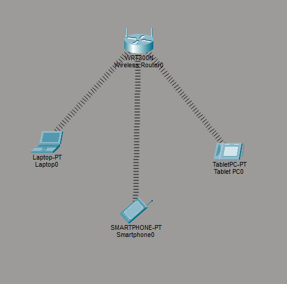
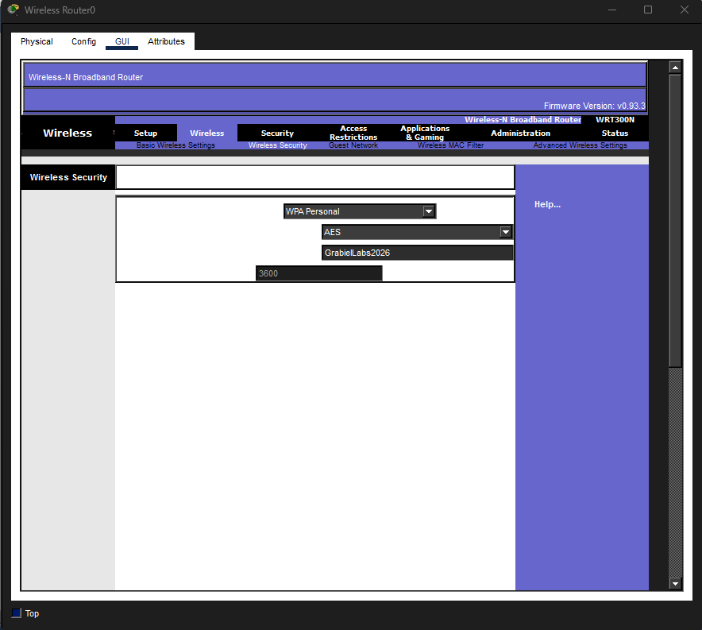
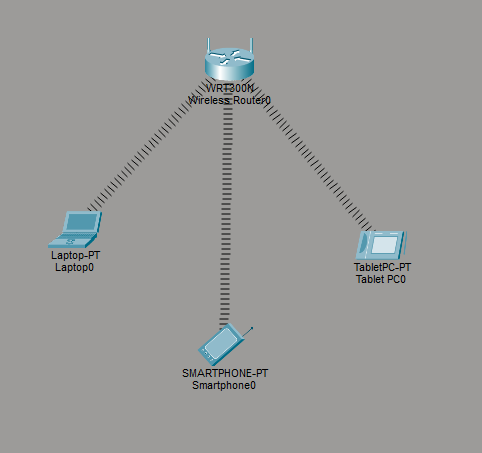
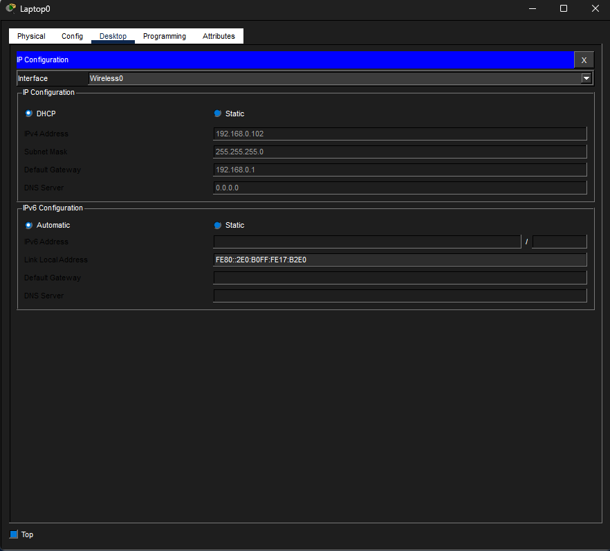
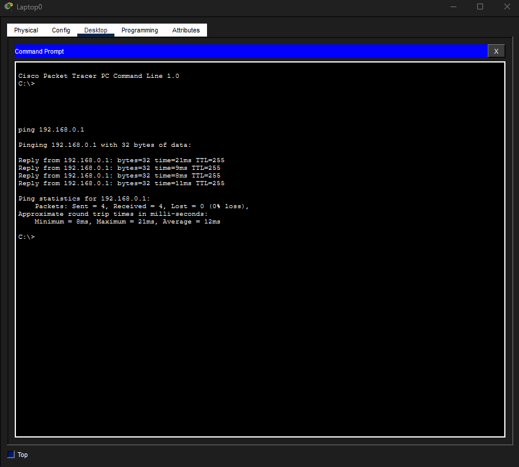

# Lab 21 – Wireless Network Deployment and Security

## Objective

Configure a secure wireless network, connect multiple wireless clients, and verify connectivity using DHCP and ICMP testing.

---

## Step 1: Build the Wireless Topology

Created a wireless network using:

- WRT300N Wireless Router
- Laptop
- Tablet
- Smartphone

Configured the devices in Infrastructure Mode, where all wireless clients communicate through a central wireless access point.

---

## Step 2: Configure Wireless Security

Configured the wireless network with:

- SSID: GrabielLabsWiFi
- Security: WPA Personal
- Encryption: AES
- Passphrase: GrabielLabs2026

This configuration helps protect the wireless network from unauthorized access.

---

## Step 3: Connect Wireless Devices

Connected the laptop, tablet, and smartphone to the wireless network using the configured SSID and passphrase.

Verified that all wireless clients successfully associated with the wireless router.

---

## Step 4: Verify DHCP Assignment

Verified that the laptop automatically received:

- IP Address
- Subnet Mask
- Default Gateway

from the wireless router's DHCP service.

---

## Step 5: Test Connectivity

Used the ping command to verify successful communication between the laptop and the wireless router.

Confirmed:

- Successful replies
- 0% packet loss
- Proper wireless connectivity

---

## What I Learned

- How wireless devices connect in Infrastructure Mode
- How SSIDs are configured and broadcast
- How wireless authentication works
- How WPA security protects wireless networks
- How DHCP automatically assigns IP addresses
- How to verify connectivity using ping
- The relationship between authentication, association, and network access

---

## Network+ Objectives Reinforced

- Wireless Network Types
- Wireless Security
- Authentication
- DHCP
- Wireless Client Connectivity
- Basic Network Troubleshooting

---

## Skills Demonstrated

- Wireless Network Configuration
- Wireless Security Implementation
- Client Association
- DHCP Verification
- Connectivity Testing
- Wireless Troubleshooting

---

## Tools Used

- Cisco Packet Tracer
