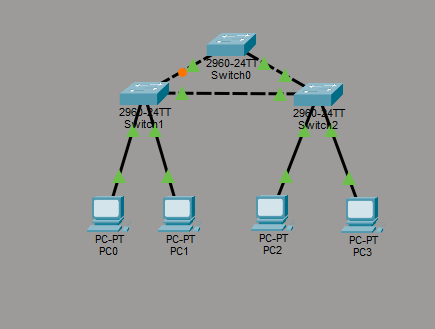
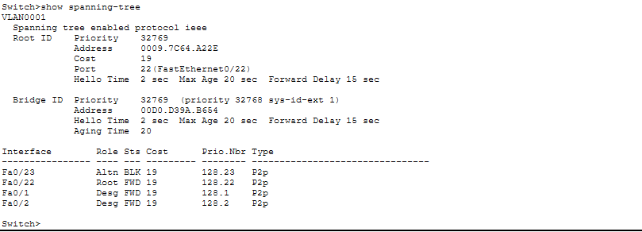
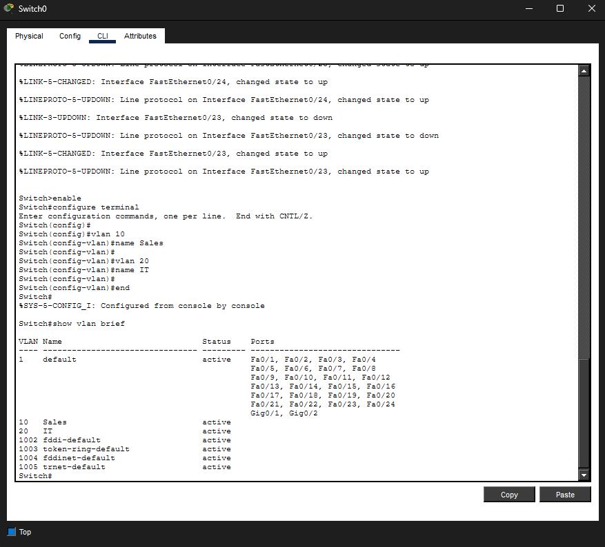
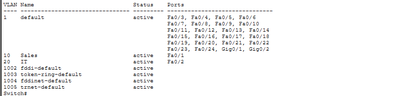
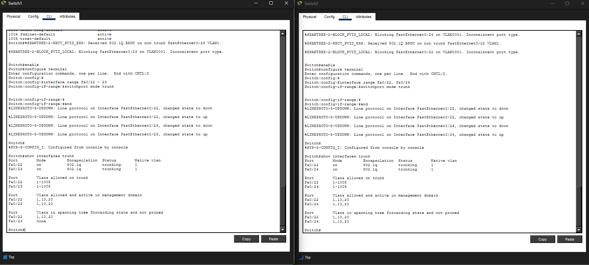
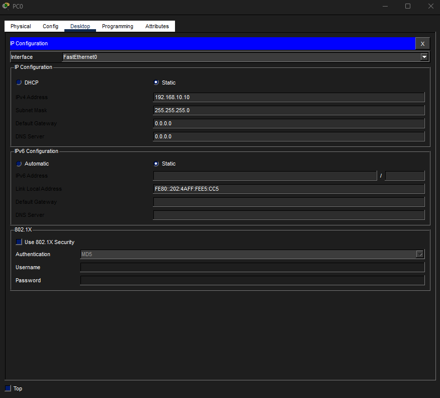
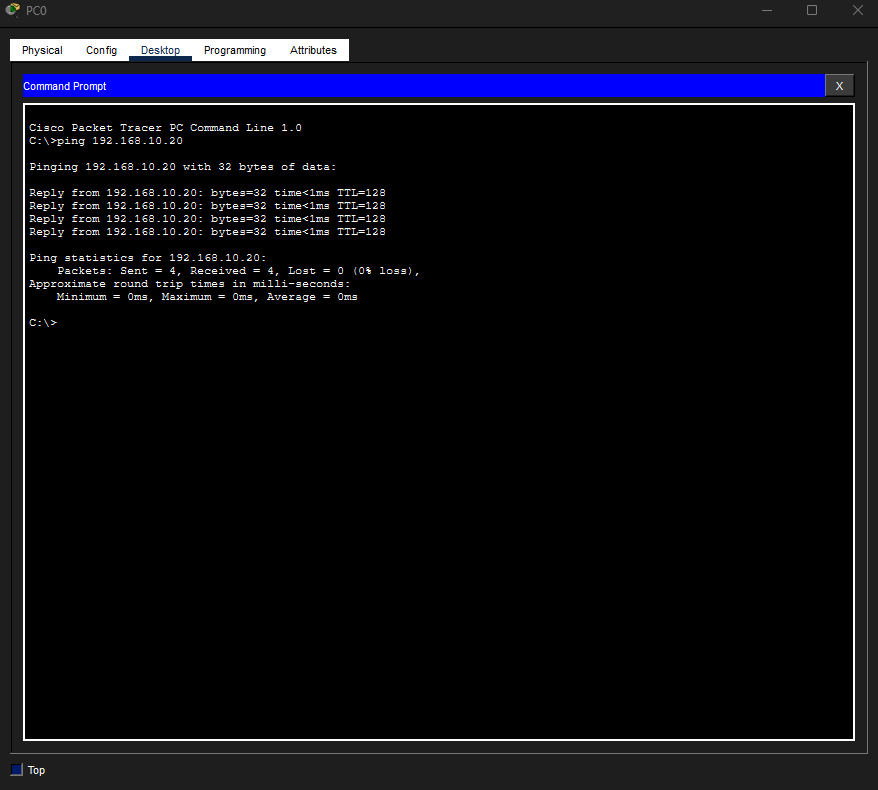
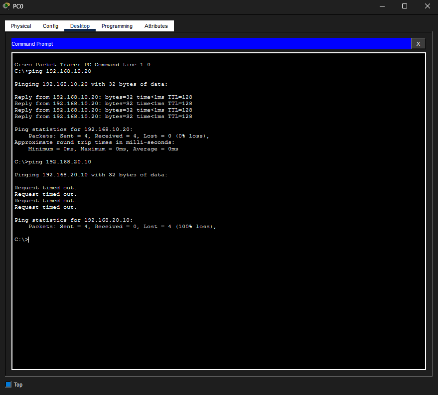
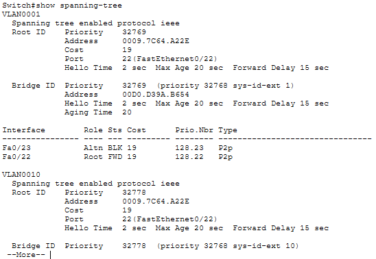

# Lab 22 – Enterprise VLAN Segmentation and Spanning Tree Protocol (STP)

## Objective

Configure VLAN segmentation across multiple switches, establish trunk links, verify VLAN communication, demonstrate VLAN isolation, and observe how Spanning Tree Protocol (STP) prevents network loops.

---

## Step 1: Build the Network Topology

Built a switched network consisting of:

- 3 Cisco 2960 Switches
- 4 PCs
- Redundant switch-to-switch connections

The redundant path was intentionally created to demonstrate STP loop prevention.



---

## Step 2: Verify STP Loop Prevention

Verified that STP detected the redundant path and placed one port into a blocking state.

This prevents broadcast storms and switching loops.



---

## Step 3: Create VLANs

Configured:

- VLAN 10 (Sales)
- VLAN 20 (IT)

Verified VLAN creation using:

```text
show vlan brief
```



---

## Step 4: Assign Access Ports

Assigned switch ports to VLANs:

### VLAN 10 (Sales)
- PC0
- PC2

### VLAN 20 (IT)
- PC1
- PC3



---

## Step 5: Configure Trunk Links

Configured trunk links between switches to allow VLAN traffic to traverse the network.

Verified trunk operation using:

```text
show interfaces trunk
```



---

## Step 6: Configure IP Addressing

Assigned static IP addresses to devices in each VLAN.

### VLAN 10
- 192.168.10.10
- 192.168.10.20

### VLAN 20
- 192.168.20.10
- 192.168.20.20



---

## Step 7: Test VLAN Communication

Verified successful communication between devices in VLAN 10.

PC0 successfully pinged PC2.



---

## Step 8: Verify VLAN Isolation

Attempted communication between VLAN 10 and VLAN 20.

The ping failed because no Layer 3 device was configured to route traffic between VLANs.



---

## Step 9: Final STP Verification

Verified that STP continued blocking the redundant path after VLAN and trunk configuration.



---

## What I Learned

- How VLANs logically segment networks
- How access ports are assigned to VLANs
- How trunk links transport multiple VLANs
- How STP prevents switching loops
- How VLANs improve security and organization
- Why devices in different VLANs require Layer 3 routing to communicate

---

## Network+ Objectives Reinforced

- Ethernet Switching
- VLAN Configuration
- VLAN Segmentation
- Trunking
- Spanning Tree Protocol (STP)
- Network Access Control Concepts
- Enterprise Switching

---

## Skills Demonstrated

- VLAN Creation
- Port Assignment
- Trunk Configuration
- STP Verification
- Layer 2 Segmentation
- Connectivity Testing
- Network Troubleshooting

---

## Tools Used

- Cisco Packet Tracer
